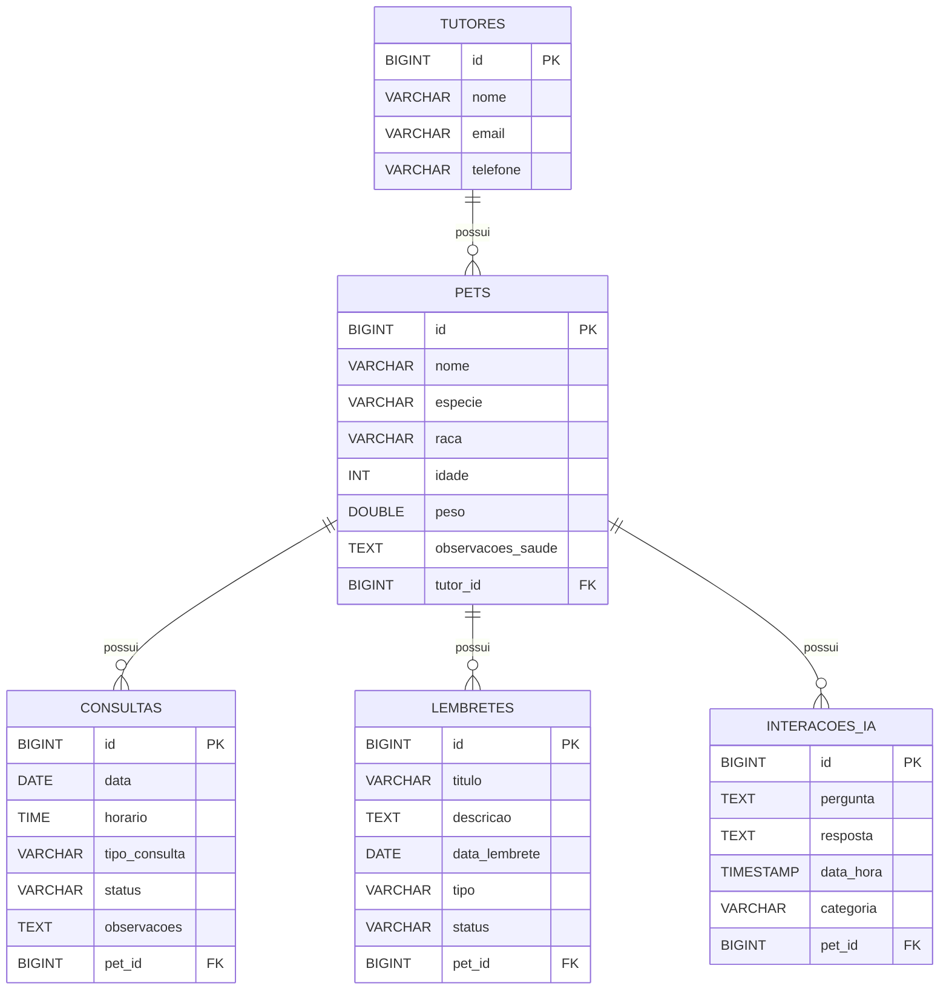
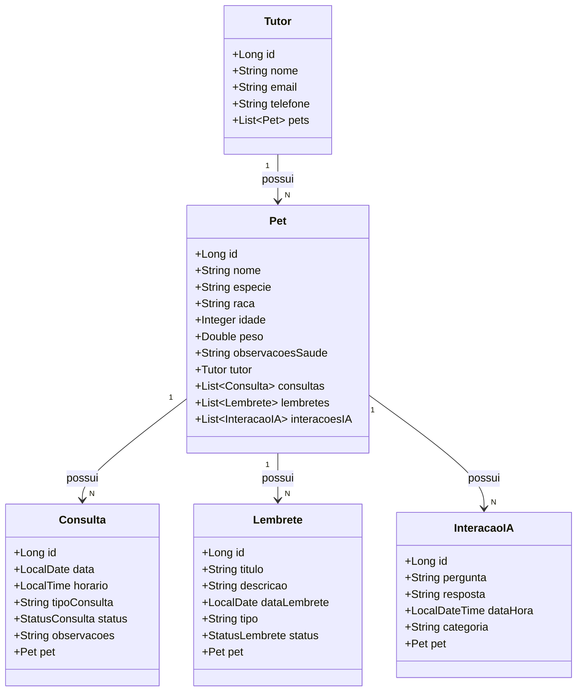

# Arquitetura — Pet Family API

---

## Arquitetura em Camadas

A API segue o padrão de **arquitetura em camadas** (Layered Architecture), separando responsabilidades de forma clara:

```
┌─────────────────────────────────────────┐
│              HTTP Client                │
│         (Postman / App Mobile)          │
└──────────────────┬──────────────────────┘
                   │ HTTP Request
┌──────────────────▼──────────────────────┐
│           Controller Layer              │
│  (TutorController, PetController, ...)  │
│  Recebe requisições, valida parâmetros  │
│  Delega para Service, retorna Response  │
└──────────────────┬──────────────────────┘
                   │
┌──────────────────▼──────────────────────┐
│            Service Layer                │
│  (TutorService, PetService, ...)        │
│  Regras de negócio, lógica de domínio   │
│  Cache (@Cacheable / @CacheEvict)       │
└──────────────────┬──────────────────────┘
                   │
┌──────────────────▼──────────────────────┐
│          Repository Layer               │
│  (TutorRepository, PetRepository, ...)  │
│  Spring Data JPA, Query Methods, JPQL   │
└──────────────────┬──────────────────────┘
                   │
┌──────────────────▼──────────────────────┐
│           Database (H2)                 │
│   tutores, pets, consultas,             │
│   lembretes, interacoes_ia              │
└─────────────────────────────────────────┘
```

### Camadas e Responsabilidades

| Camada | Pacote | Responsabilidade |
|---|---|---|
| Controller | `controller/` | Receber HTTP, validar entrada, retornar resposta |
| DTO | `dto/request/` e `dto/response/` | Contrato de entrada e saída da API |
| Service | `service/` | Regras de negócio, cache, conversão entidade↔DTO |
| Repository | `repository/` | Acesso ao banco, queries, paginação |
| Entity | `entity/` | Mapeamento JPA das tabelas do banco |
| Exception | `exception/` | Tratamento global de erros |
| Config | `config/` | Cache, OpenAPI, dados iniciais |

---

## Descrição das Entidades

### Tutor
Representa o responsável pelos pets. Pode ter múltiplos pets cadastrados.

| Campo | Tipo | Restrição |
|---|---|---|
| id | Long | PK, auto-gerado |
| nome | String | NOT NULL |
| email | String | NOT NULL, UNIQUE |
| telefone | String | Opcional |

### Pet
Representa o animal de estimação com dados clínicos. Pertence a um tutor e tem histórico completo.

| Campo | Tipo | Restrição |
|---|---|---|
| id | Long | PK, auto-gerado |
| nome | String | NOT NULL |
| especie | String | NOT NULL |
| raca | String | Opcional |
| idade | Integer | Positivo |
| peso | Double | Positivo |
| observacoesSaude | Text | Opcional |
| tutorId | Long | FK → Tutor |

### Consulta
Registro de consultas veterinárias com status de acompanhamento.

| Campo | Tipo | Restrição |
|---|---|---|
| id | Long | PK, auto-gerado |
| data | LocalDate | NOT NULL |
| horario | LocalTime | Opcional |
| tipoConsulta | String | NOT NULL |
| status | Enum | AGENDADA, REALIZADA, CANCELADA |
| observacoes | Text | Opcional |
| petId | Long | FK → Pet |

### Lembrete
Lembretes preventivos para ações de saúde do pet.

| Campo | Tipo | Restrição |
|---|---|---|
| id | Long | PK, auto-gerado |
| titulo | String | NOT NULL |
| descricao | Text | Opcional |
| dataLembrete | LocalDate | NOT NULL |
| tipo | String | NOT NULL |
| status | Enum | PENDENTE, CONCLUIDO, CANCELADO |
| petId | Long | FK → Pet |

### InteracaoIA
Histórico de perguntas e respostas simuladas com assistente de IA para saúde animal.

| Campo | Tipo | Restrição |
|---|---|---|
| id | Long | PK, auto-gerado |
| pergunta | Text | NOT NULL |
| resposta | Text | NOT NULL |
| dataHora | LocalDateTime | NOT NULL |
| categoria | String | Opcional |
| petId | Long | FK → Pet |

---

## Relacionamentos

```
Tutor 1 ──────── N Pet
Pet   1 ──────── N Consulta
Pet   1 ──────── N Lembrete
Pet   1 ──────── N InteracaoIA
```

- **Tutor → Pet:** Um tutor pode ter muitos pets. Remoção em cascata.
- **Pet → Consulta:** Um pet possui histórico de consultas. Remoção em cascata.
- **Pet → Lembrete:** Um pet possui lembretes preventivos. Remoção em cascata.
- **Pet → InteracaoIA:** Um pet possui histórico de interações com IA. Remoção em cascata.

---

## DER — Diagrama Entidade-Relacionamento (Mermaid)



---

## Diagrama de Classes (Mermaid)



---

## Estratégia de Cache

O cache usa **Caffeine** com expiração de 5 minutos e máximo de 500 entradas:

| Cache | Evictado quando |
|---|---|
| `tutores` | criar, atualizar ou deletar tutor |
| `pets` | criar, atualizar ou deletar pet/tutor |
| `consultas` | criar, atualizar ou deletar consulta |
| `lembretes` | criar, atualizar ou deletar lembrete |
| `dashboard` | qualquer alteração nos dados |
